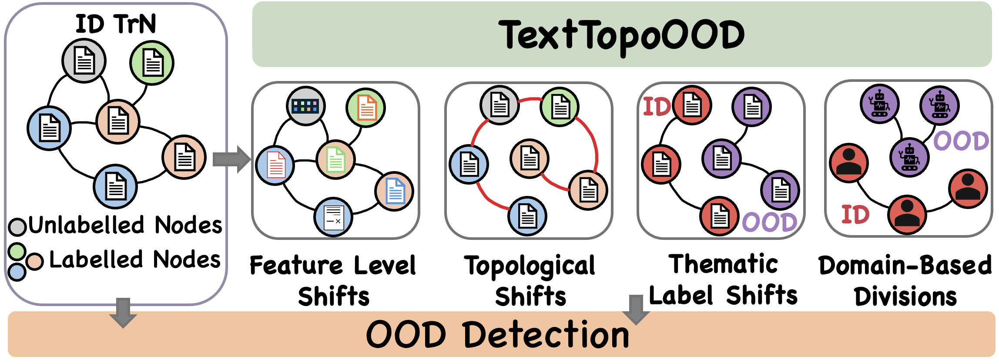

# TNTOOD & TextTopoOOD

This repository contains the implementation for the EMNLP2025 paper "Text Meets Topology: Rethinking Out-of-distribution Detection in Text-Rich Networks".

## Intro
Out-of-distribution (OOD) detection remains challenging in text-rich networks, where tex- tual features intertwine with topological struc- tures. Existing methods primarily address la- bel shifts or rudimentary domain-based splits, overlooking the intricate textual-structural di- versity. For example, in social networks, where users represent nodes with textual features (name, bio) while edges indicate friendship status, OOD may stem from the distinct lan- guage patterns between bot and normal users. To address this gap, we introduce the Text- TopoOOD framework for evaluating detection across diverse OOD scenarios: (1) attribute- level shifts via text augmentations and em- bedding perturbations; (2) structural shifts through edge rewiring and semantic connec- tions; (3) thematically-guided label shifts; and (4) domain-based divisions. Furthermore, we propose TNT-OOD to model the complex interplay between Text aNd Topology using: 1) a novel cross-attention module to fuse lo- cal structure into node-level text representa- tions, and 2) a HyperNetwork to generate node-specific transformation parameters. This aligns topological and semantic features of ID nodes, enhancing ID/OOD distinction across structural and textual shifts. Experiments on 11 datasets across four OOD scenarios demon- strate the nuanced challenge of TextTopoOOD for evaluating OOD detection in text-rich net- works.



## Dependencies
- Python 3.9.2
- Cuda 12.4
- Torch 2.5.1
- ogb 1.3.6
- torch_geometric 2.6.1
- torch_sparse 0.6.18
- nltk 3.9.1

```bash
pip install -r requirements.txt
```

## Usage
### 1. Installation
Clone the repository and install dependencies:
```bash
git clone https://github.com/DannyW618/TNT.git
cd TNT
pip install -r requirements.txt
````

### 2. Download datasets
Please download the dataset via:

```bash
pip install gdown
gdown 1cZDOK12AVhT2MnrE6ZeLWJZLlAp81bey -O datasets.zip
unzip datasets.zip -x "__MACOSX/*"
```

### 3. Running Experiments

Run an experiment with:

```python
python main.py --datasets cora --shift_type feature --noise_level 0.9 --num_layers 2 --learning_rate 0.0001 --dropout 0.3 --use_tntood
```
* More examples can be found in `runtnt.sh`.


Key arguments:
* `--datasets` : Choose dataset (e.g., `cora`, `citeseer`, `pubmed`, `arxiv`, etc.).
* `--shift_type` : Select OOD shift type (`feature`, `structure`, `text`, `text_swap`, `semantic_connection`).
* Default settings are defined in `config.py` and more arguments are in `argparser.py`.

> Note: We have also provided the ID/OOD splits embeddings, you may choose to generate your own with different perturbation configs using `ood_generation.py`.


## Supported OOD Shifts

* **Feature Shift** - Noisy or perturbed node features.
* **Structure Shift** - Graph topology altered using SBM-based rewiring.
* **Text Shift** - Corruption or perturbation of node text attributes.
* **Text Swap** - Random swapping of text features across nodes.
* **Semantic Connection Shift** - Alteration of graph connectivity based on semantic similarity metrics.
* **Label Leave Out** - Leave out a set of classes as OOD data.

## Repository Structure

- **`tntood`**  
  Primary folder containing the code for TNTOOD.

- **`datasets`**  
  Contains the dataset used. 

- **`embeddings`**  
  An embeddings folder will be created after running a given experiment setup to cache the created OOD splits for faster loading.

- **`tntood/main.py`**  
  Entry point for running experiments. Handles configuration loading, dataset preparation, model initialization, training, and evaluation.

- **`tntood/runtnt.sh`**  
  Example scripts to run experiments.

## Acknowledgement
We thank the authors of [TSGFM](https://github.com/CurryTang/TSGFM) and [GLBench](https://github.com/NineAbyss/GLBench) for the datasets.


## Citation

The bib ref for our paper is as follow:

```
@inproceedings{tntood,
  title = {Text Meets Topology: Rethinking Out-of-distribution Detection in Text-Rich Networks},
  author = {Danny Wang and Ruihong Qiu and Guangdong Bai and Zi Huang},
  booktitle = {Empirical Methods in Natural Language Processing (EMNLP)},
  year = {2025}
  }
```
